<h3 align="center">
  
   
   
  
</h3>
 
 

# React Native Katas

This is a project that lets you participate in a fully-immersive,
hands-on, and fun learning experience for React Native.

We will focus solely about _design and styling_ for React Native,
making this a perfect learning aid for both programmers and designers
that previously handled Sass or CSS.

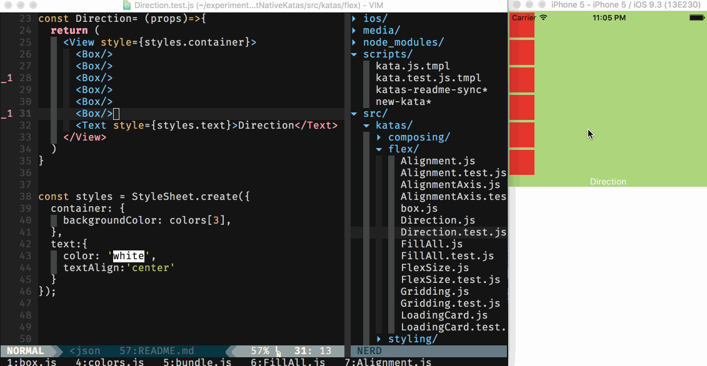

## What's a Kata

This is a [Kata](https://en.wikipedia.org/wiki/Kata). For programming, this means
a way to practice something, which is simple enough. However, traditionally
programming katas or programming [Koans](https://en.wikipedia.org/wiki/K%C5%8Dan) are
made to "learn the hard way".

Learning "the hard way" primes your brain to receive information and accelerates
the learning process considerably on the expense of frustration.

This process, like many other Kata or Koan based projects, aims to give you
the best experience possible so that you can fail with a nice safety net and
learn from your failures quickly.

For this, we use:

* A fancy framework that sets up, runs, and validates your Katas
* A smart layout of learning material so that one builds on the other, yet lets you discover things on your own
* Some times [things are repeated](https://en.wikipedia.org/wiki/Spaced_repetition)
* React Native's live-reload for rapid iteration
* Simulator friendly set up, so that you will get full-immersion, working on the same physical space as your desktop
* Tips and guides along the way, so that you will always know what to do

## Quick Start

I assume you already have a [working react-native setup](https://facebook.github.io/react-native/docs/getting-started.html).

* Clone this project
* `npm i` and then run the project via Xcode or `react-native`
* After running the project, turn on Live Reload (Ctrl+Cmd+Z for developer menu on iOS Simulator)

You will then be faced with the first Kata.

* Press on a Kata (anywhere) to show the reference Kata - which is what you
  should arrive at
* Press again to go back to your answer Kata
* Find your [src/katas](src/katas) folder
* Get familiar with the [list of katas available](src/katas/bundle.js)
* Per subject (flex, styling, composing), look for the `.test` version of your Kata and edit away. The reference
Kata is the one without the `.test` suffix.
* Example: `FillAll` under the `flex` subject, will be at [src/katas/flex/FillAll.test.js](src/katas/flex/FillAll.test.js), and
the reference Kata will be at [src/katas/flex/FillAll.js](src/katas/flex/FillAll.js)
* Modify, view, until both Katas match.
* Once Katas match, you will be automatically moved to a new Kata to solve

### Checking Results

At any point in time, you can click on your view to show the reference view, and click
again to go back.

If you've successfully solved the current view, you'll be *automatically* progressed
to the next Kata.

### Learning

Learn by making mistakes ("The Hard Way"). By making mistakes, you're priming
your brain to receive and retain data in a much better way than reading a book
or watching a video.

Use the tips in the `.test` versions of the components. Sometimes there will be
tips, sometimes there won't be. Some times the tips will be somewhat opaque,
sometimes very revealing.

1. Use the tips
2. Think, experiment, think, and experiment again
3. Use Google
4. Go to (2)
5. Eventually, take a look at the reference component (read: answers)

The reference components won't have a `test` suffix. You'll be able to find
solutions there and if a concept is first introduced or demands a special
explanation - it will be explained inline for your convenience, look for
the `Did you know?` sections, `Hints` sections, and `TODO` notes.

## Building Katas

You're more than welcome to submit new katas. Please see the [kata building doc](docs/kata_builders.md) for details.

## Under the Hood

There's a reference Kata, and a test Kata (the one you fiddle with). They're
wrapped with a special snapshotting component that exists within the
[runner](src/runner) infrastructure.

With that, a reference Kata is mounted, rendered, snapshotted (visually), and
then your test Kata goes through the same process. We then diff the two
snapshots to see if the designs match for your Kata to be marked as solved.

So, this is not the regular testing framework you'd expect.

That was done because design needs creative freedom. This means there's more
than one way to solve a Kata, as long as you get the same visuals!

This also means that you're welcome to make forks with better solutions, and offer
these as the de-facto reference Katas for next generations to come!

## Katas

<!-- KATAS_START -->

### UsingText

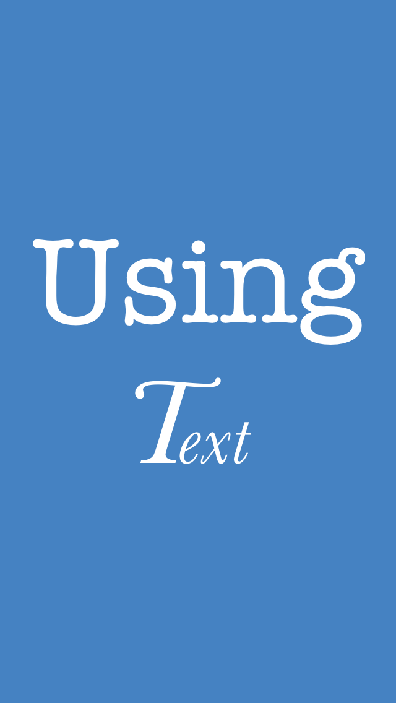

### UsingStyles

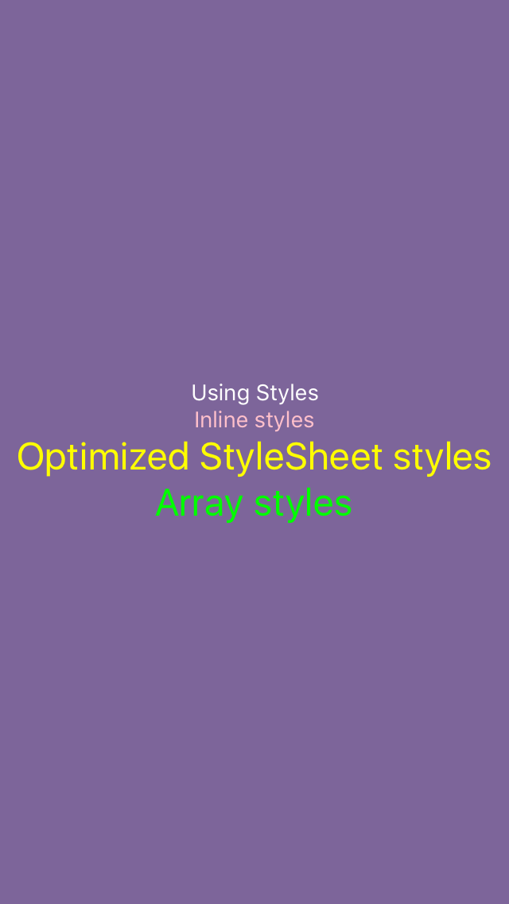

### Clipping

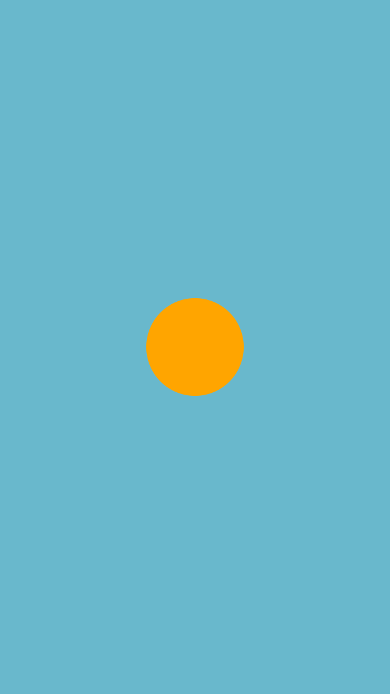

### BorderRadius

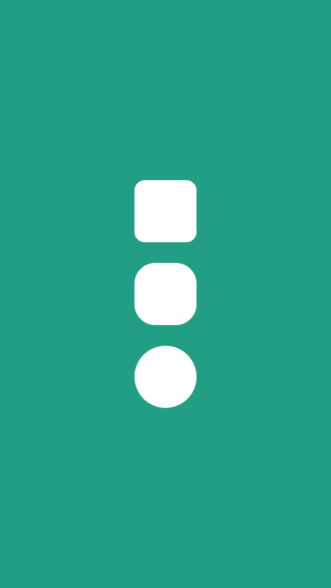

### LoadingCard

### Gridding

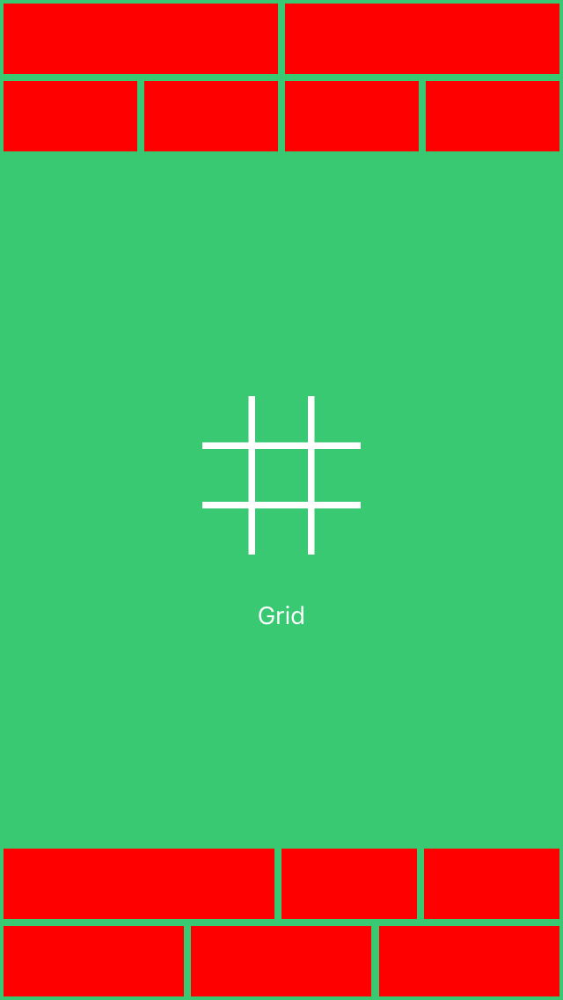

### FlexSize

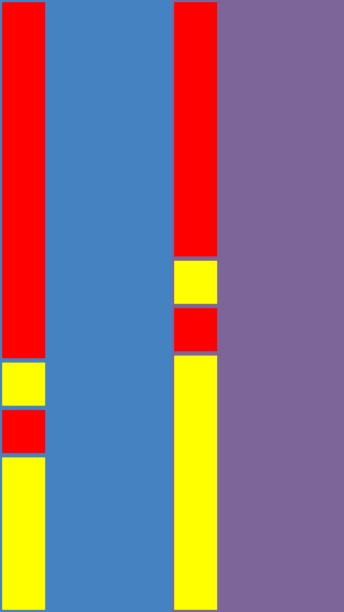

### FillAll

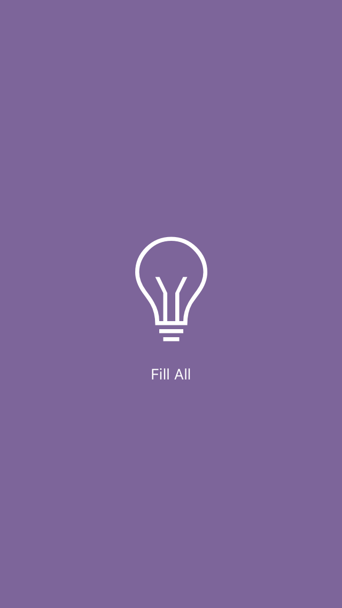

### Direction

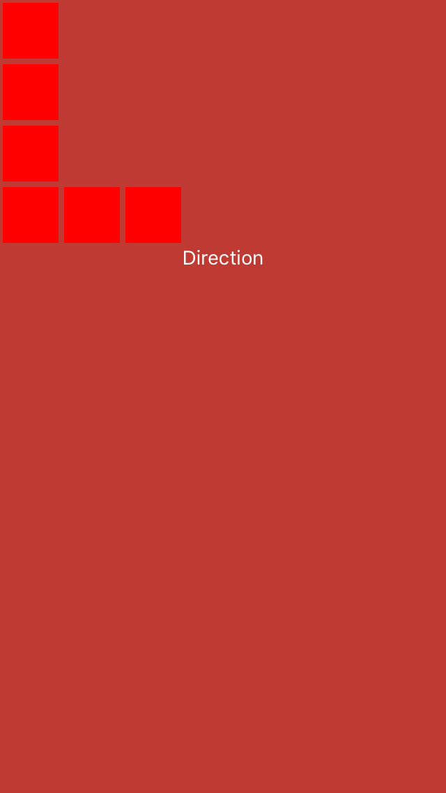

### AlignmentAxis

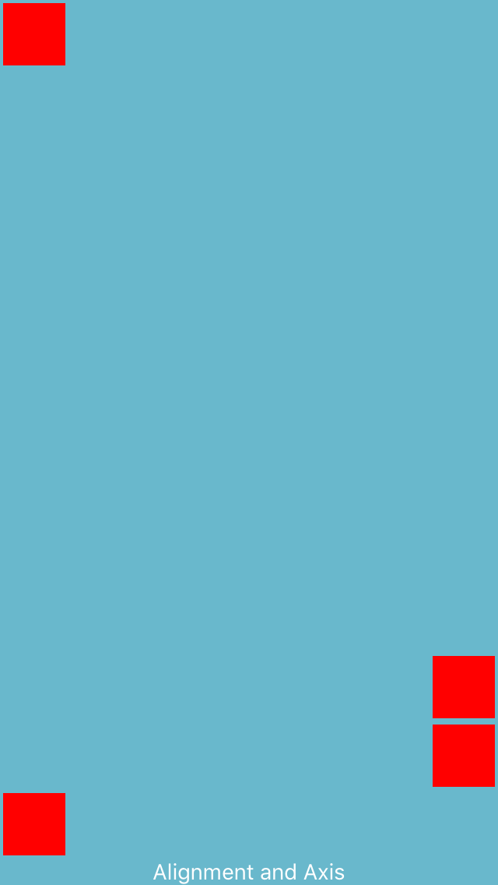

### Alignment

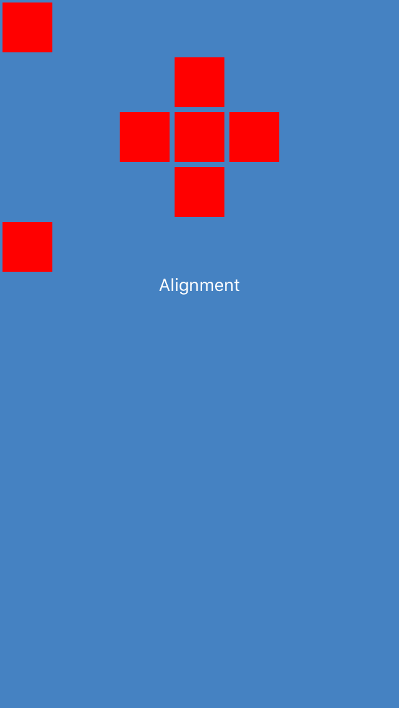

### SimpleChart

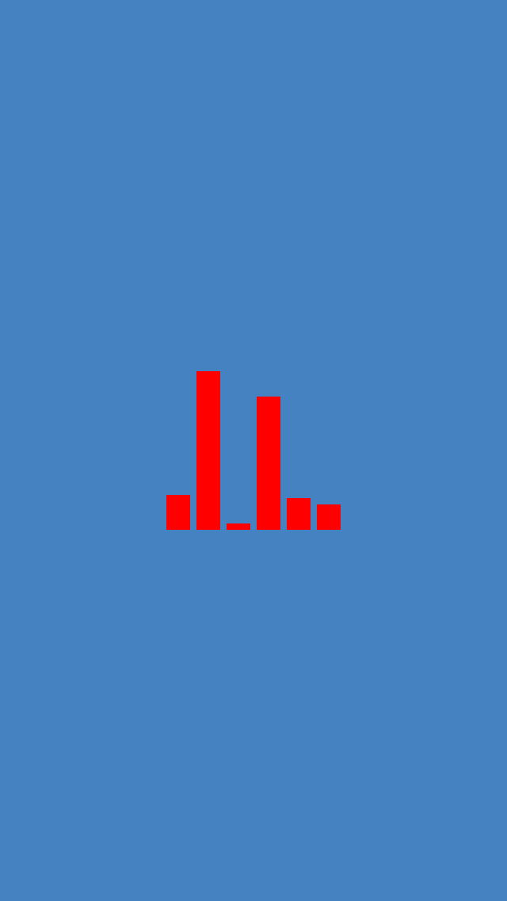

### ProfileScreen

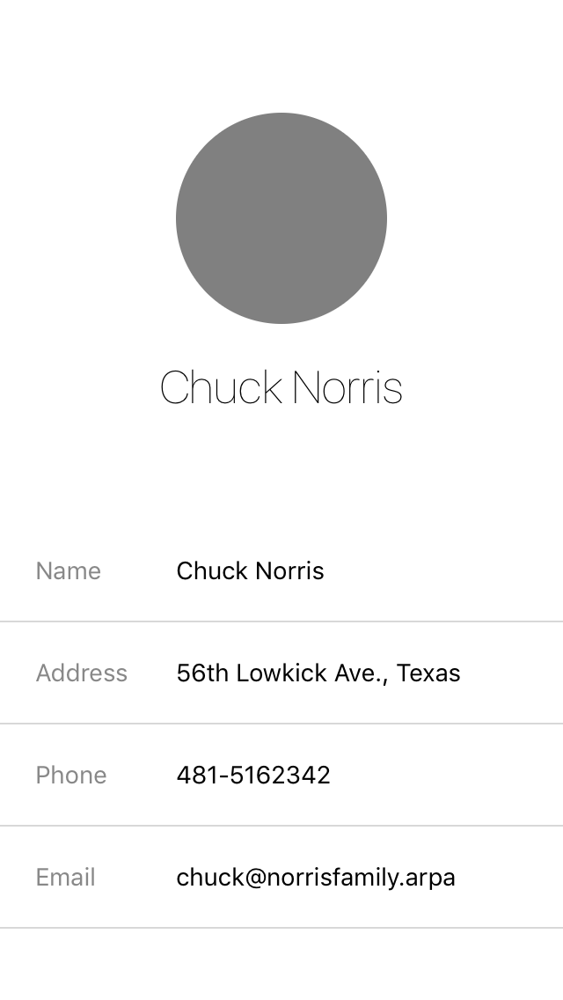

### ContactCard

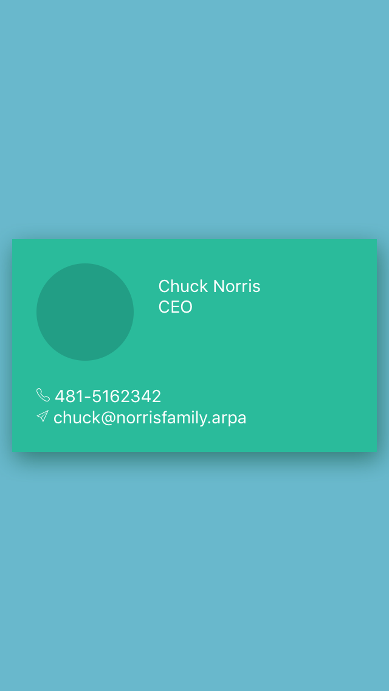

### CalendarMonth

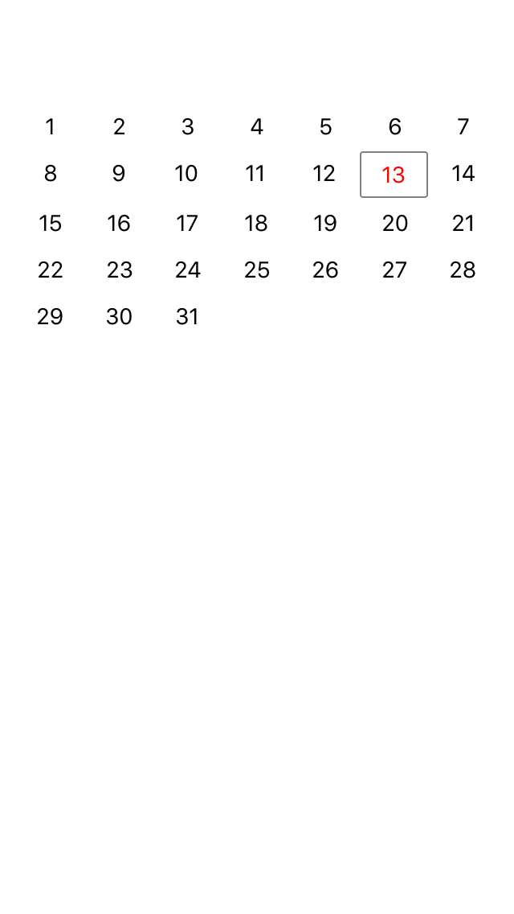

<!-- KATAS_END -->
